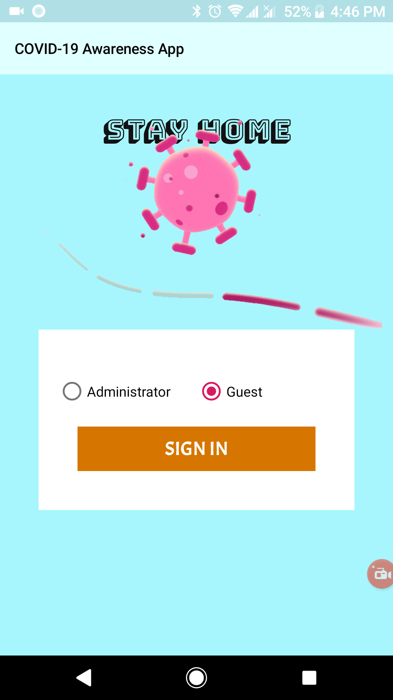
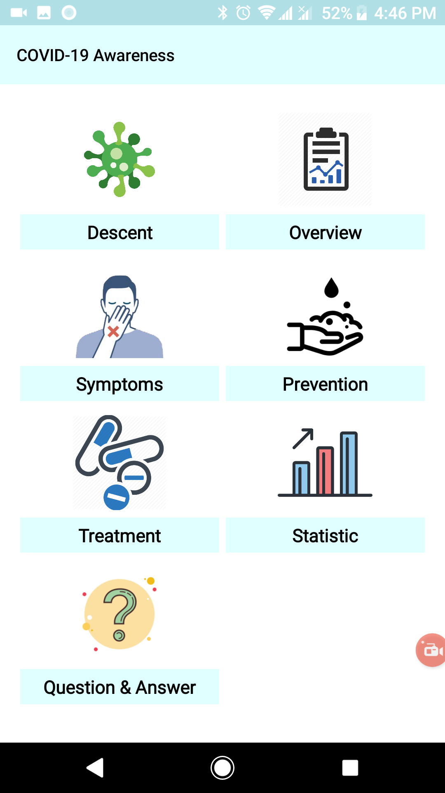
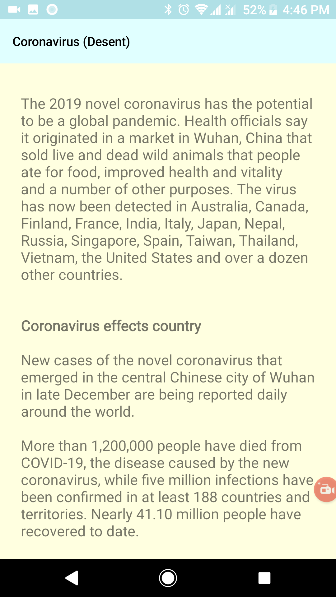
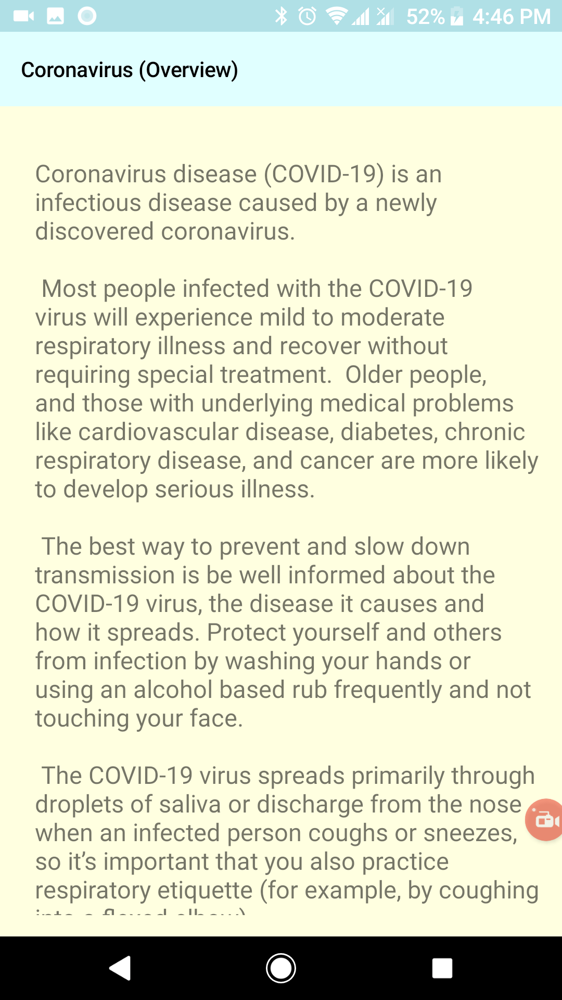
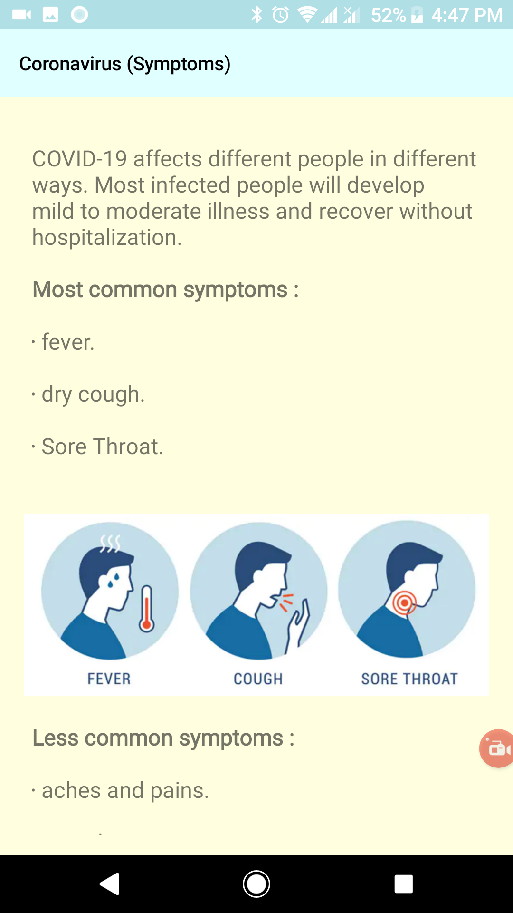
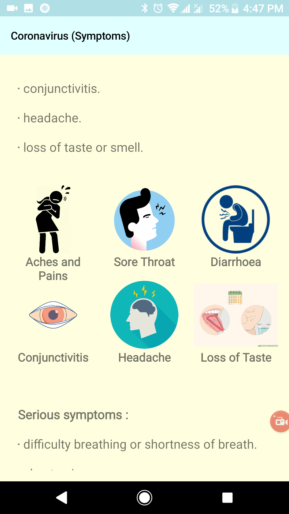
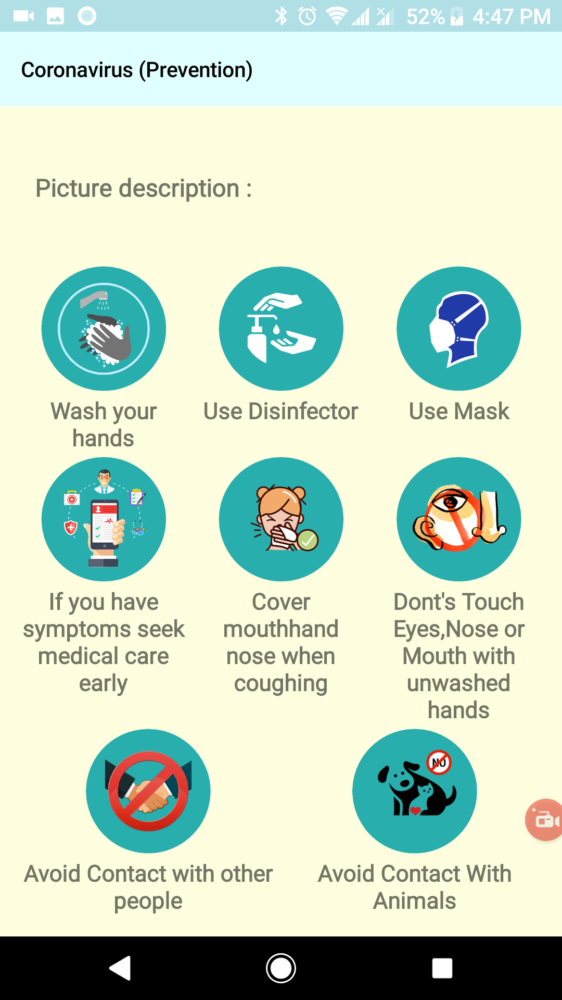
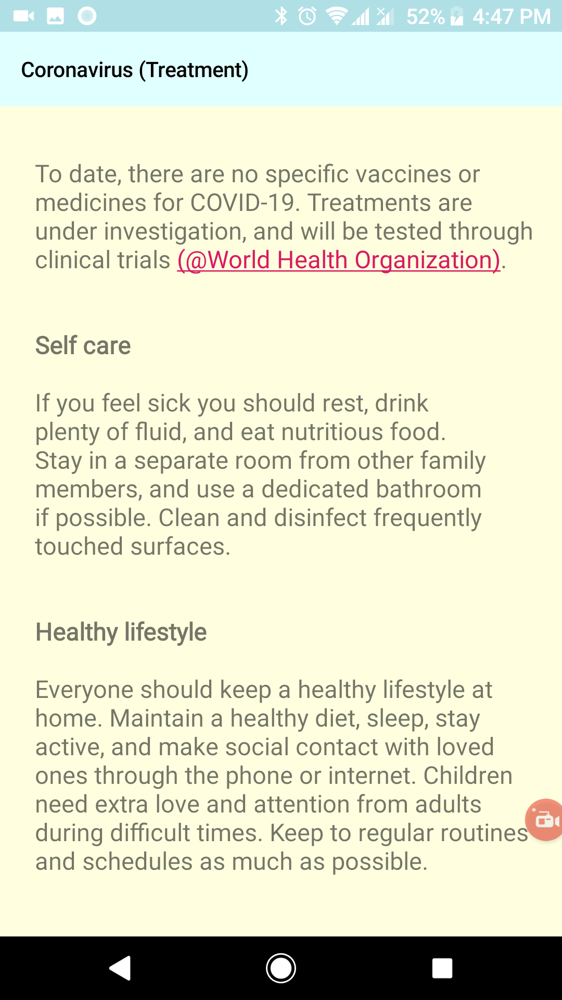
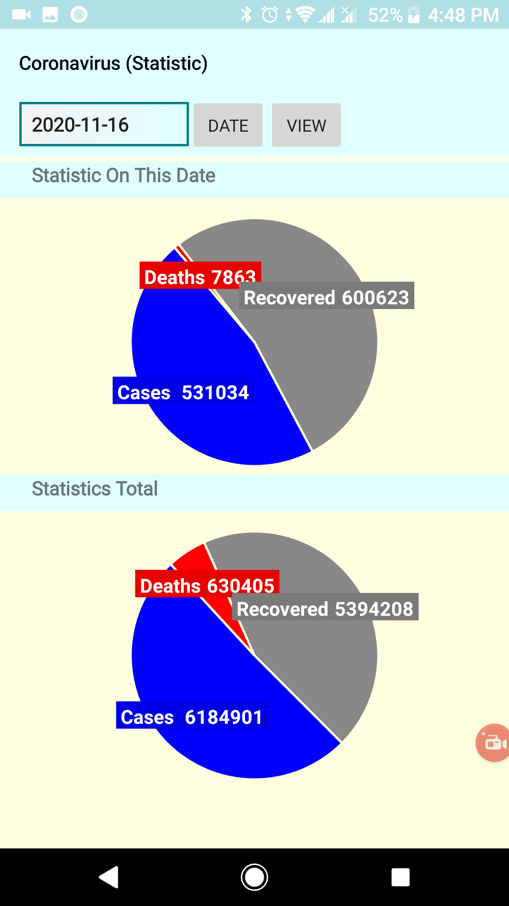
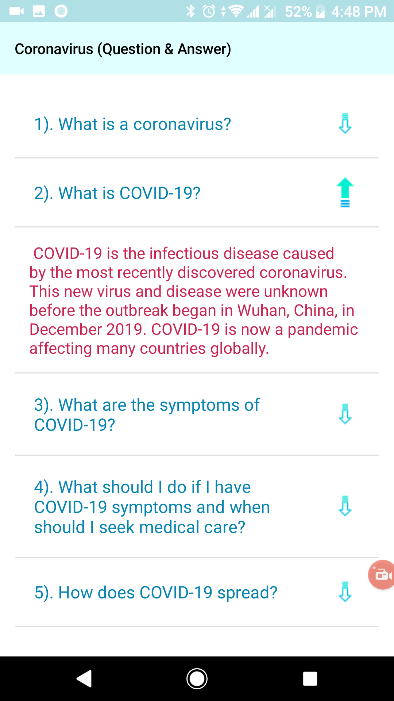

# Demo-Awarenessapp
 This a demo awarenessapp. (2020)

This is made for a school project showcase. Nothing related to doctoral recommendation.
This is only made for dummy purposes. Nothing related to commercial use. 
 
## Project description
Name: Demo-Awarenessapp  
Programming Language: Java  
Platfrom: Android application
Project No: update me 
Year: 2020

## Demo Video
<!--  -->

## Screen shot

### login

### Home

### Desent

### Overview

### Symptoms

### Prevention

### Treatment

### Statistic

### Q&A

 
 

### Admin Access
#### Statistic

#### add data

## Authors

* **AbirHasan**

Check out my other works [@XAbirHasan](https://github.com/XAbirHasan)